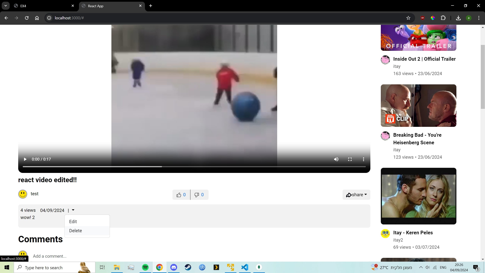
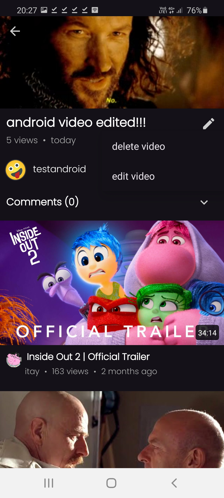
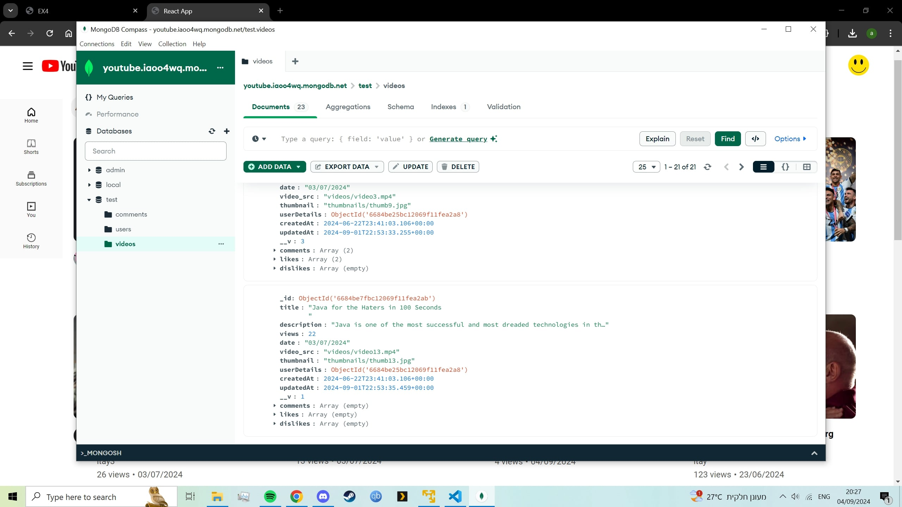
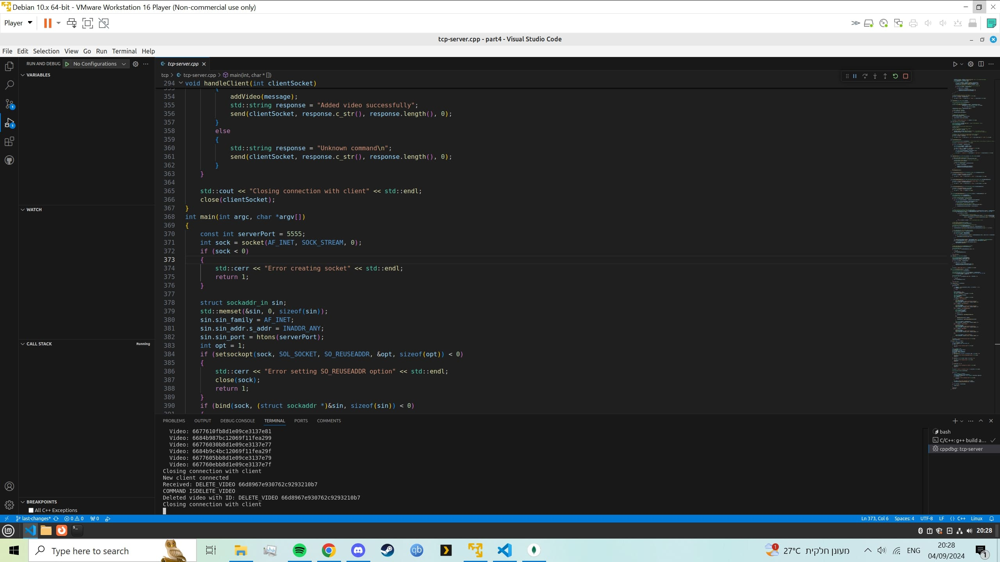
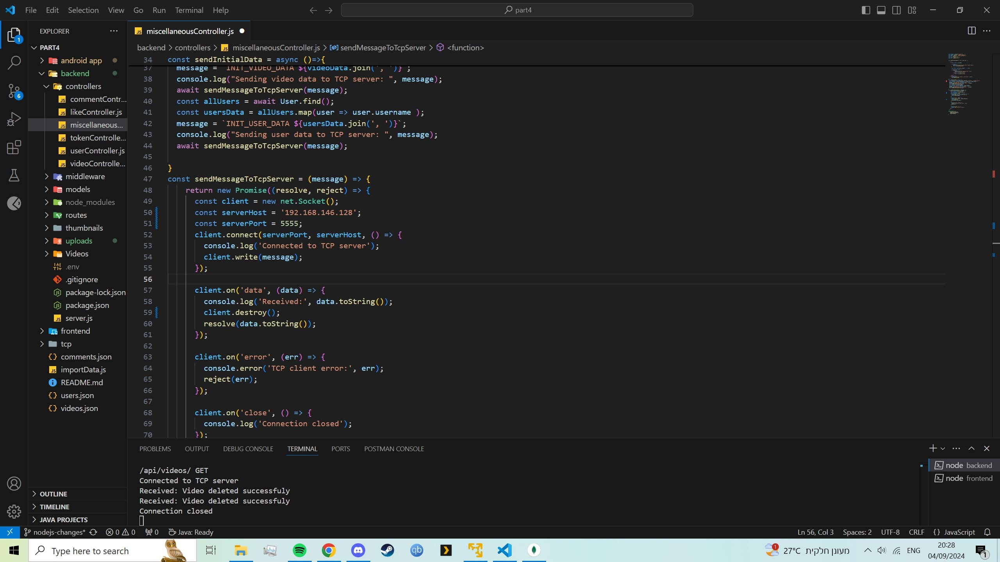

# Deleting videos in the react and android apps.
This section shows how deleting the videos on the apps works.

# Deleting in the react app.

1. First we navigate to our video (making sure that we are connected to the user that uploaded the video), and press the 3 dots button , we choose delete.  

   

2. We can see the before state of our mongo database.  

   

3. This is after the delete was pressed.

   

# Deleting in the react app.

1. First we navigate to our video (making sure that we are connected to the user that uploaded the video), and press the pencil button , we choose delete.  

   

2. We can see the before state of our mongo database.  

   

3. This is after the delete was pressed.

   

# Tcp and nodejs confirmations.

1. We can see that our tcp server recieved a command from the nodejs server to delete the videos with their ids.  

   

2. Our nodejs server recieving confirmation that the videos were deleted.  

   

