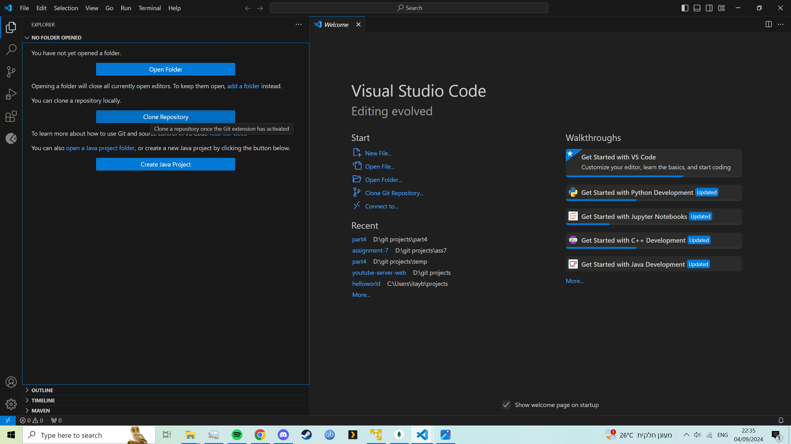
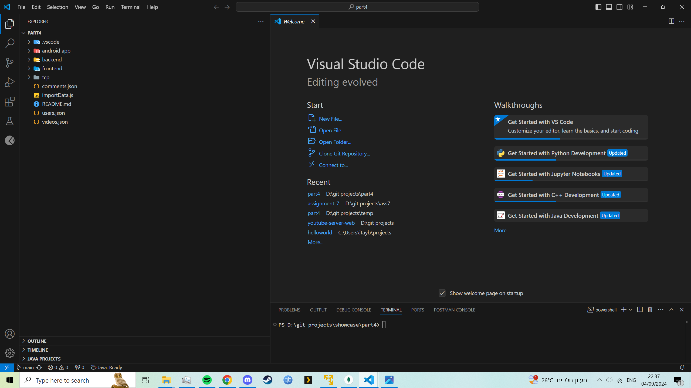
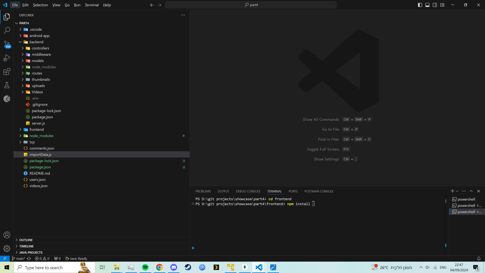
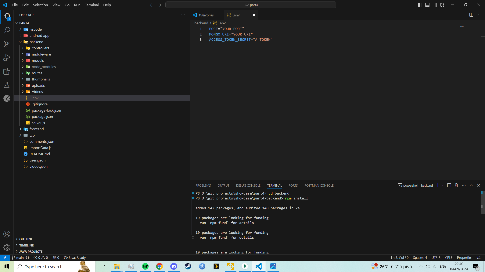
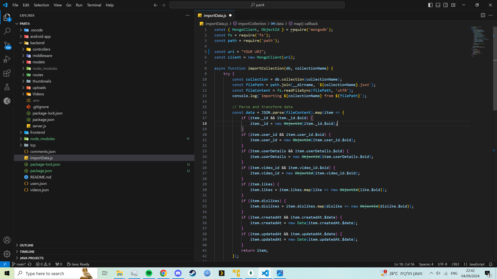
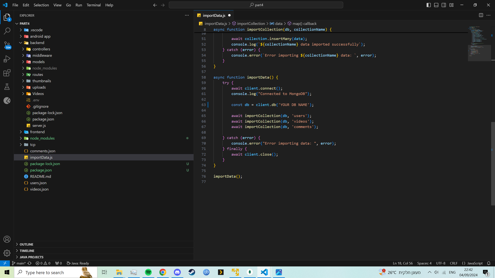
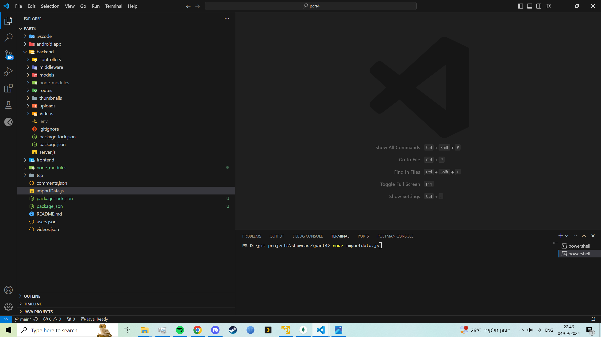
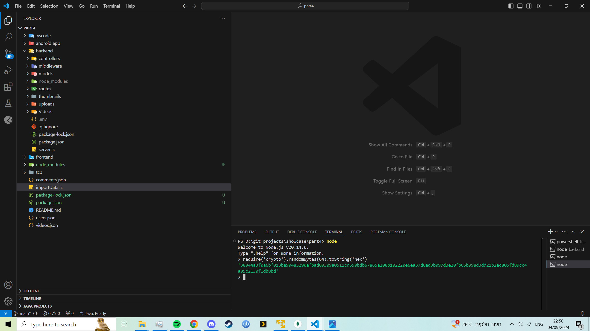
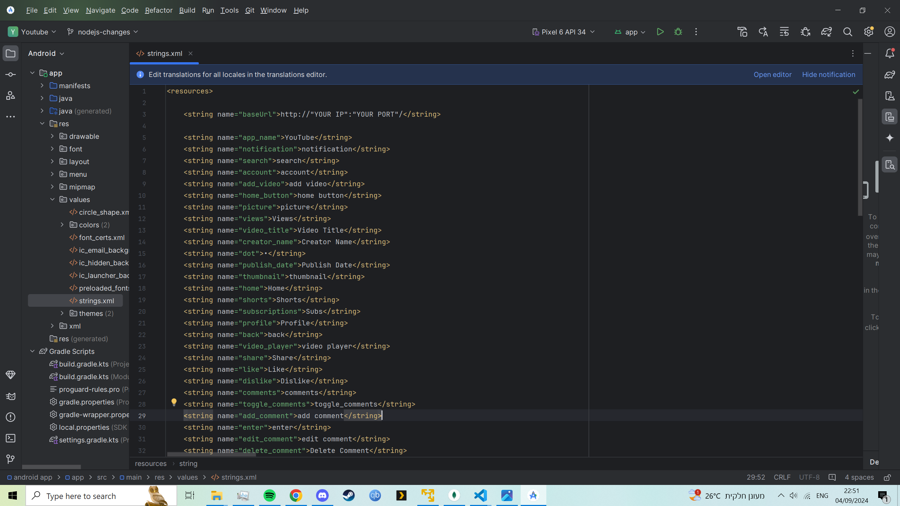

# General setting up.
This section shows a few things that are needed to be done before running the project.
Important things to do before running the project: setting up the mongodb ,.env file , changing android res value, changing miscellaneousController ip 

# Getting the project.

1. clone the project to your pc.  

   

2. Navigate to the backend folder using cd backend , and use npm install.  

   

3. Navigate to the frontend folder using cd frontend , and use npm install.  

   

# Uploading our videos to your mongodb.

1. Navigate to the backend folder using cd backend, and create a .env file filling in PORT:"your port" MONGO_URI="your connection string" ACCESS_TOKEN_SECRET= "any token we will show how to produce one" .  

   

2. Navigate to the main folder and use npm install mongodb.

   

3. Open importData.js and change const uri to be your uri.

   

4. Change client.db("your connection string").

   

5. Run node importData.js and you should see confirmations it uploaded the data.

   

# Producing secret token.

1. Open a terminal and insert node , then insert require('crypto').randomBytes(64).toString('hex') and copy the output.  

   

# Android set up.

1. Navigate to res/values/strings and change the baseurl to be "http://"your ip":"your port".  

   

