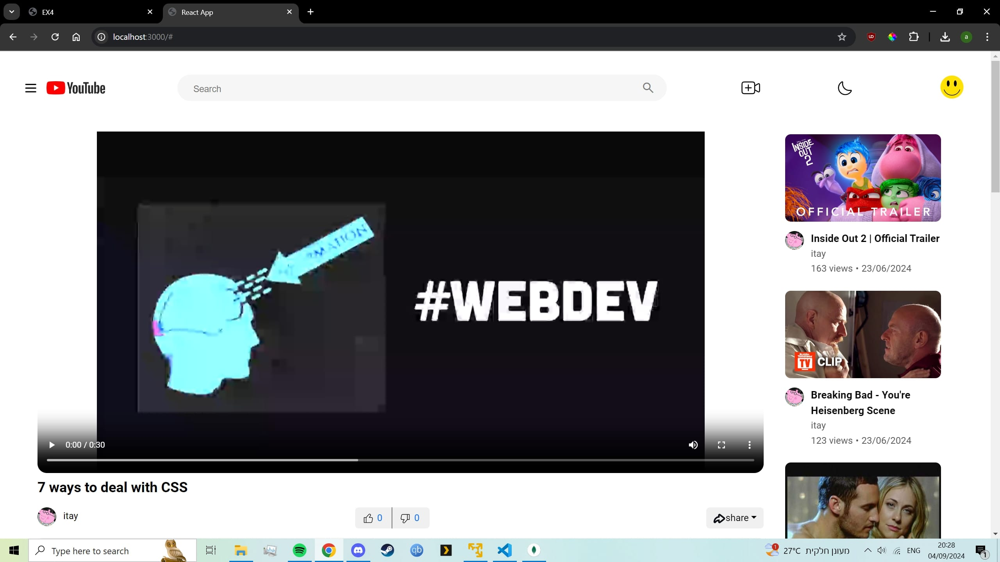
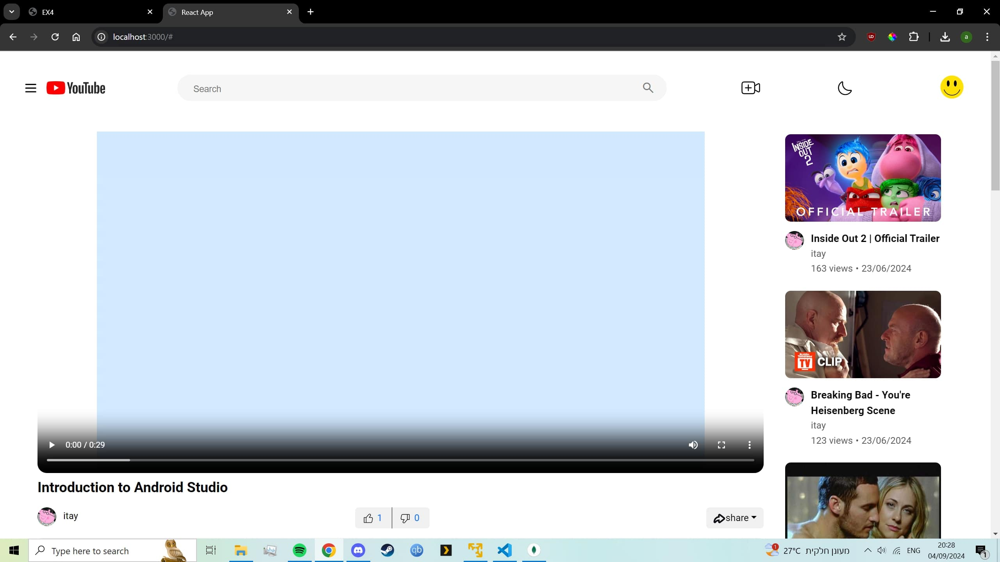
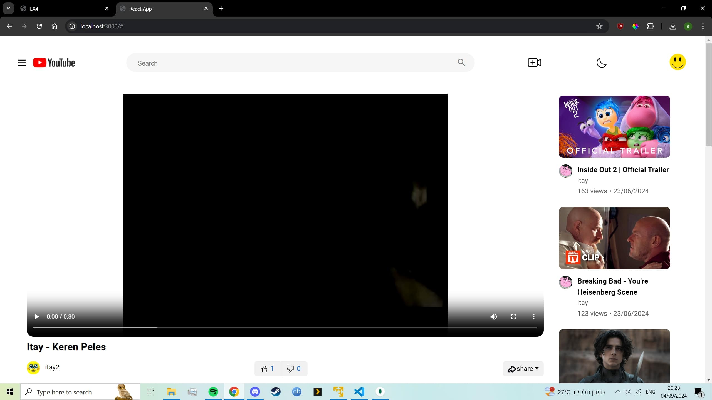
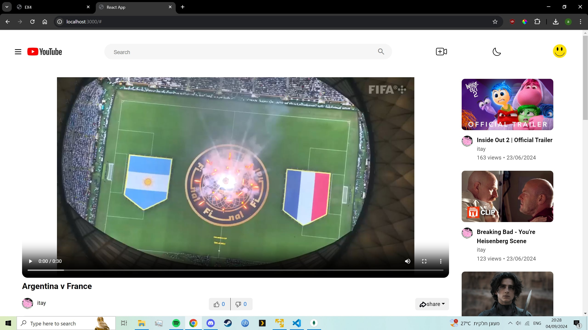

# Video reccomendation algorithm.
This section shows an example of the video reccomendation algorithm working.

# Viewing videos in the react app on user1.

1. We login to user1 and start by watching "7 ways to deal with css".  

   

2. We then view "introduction to android studios".  

   

3. We then view "itay-keren peles".

   

4. We then view "argentina vs france", overall meaning those 4 videos have been watched together, meaning for any one of those videos if we watch one of them we should get recommended the others first.

   

# Viewing on the android app.

1. First we login to a different user then the one we just used, well call it user2.  

   

2. We start by viewing "7 ways to deal with css".  

   

3. We are recommended "itay-keren peles" since user1 watched that alongside "7 ways to deal with css".

   

4. We are recommended "argentina vs france" since user1 watched that alongside "7 ways to deal with css".

   

5. We are recommended "introduction to android studios" since user1 watched that alongside "7 ways to deal with css".

   

6. We login to a new user.

   

7. We watch a video that hasnt been mentioned yet, and we are recommended the most popular videos by views, since we didnt pick any of the previous videos those are the default reccomendations.

   

