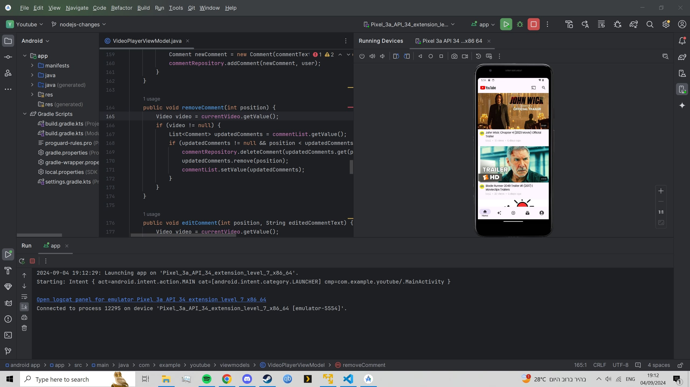

# Running the Project

This section provides a step-by-step guide on how to set up the project, including the TCP server, Node.js server, and the React/Android apps.

## TCP Server Setup
1. First, open the `tcp` folder in a Linux environment and navigate to `tcp-server.cpp`.  

   

2. Once in `tcp-server.cpp`, simply run it by pressing `F5`.  

   

3. On success, a message saying "Listening on port 5555" will appear in the terminal.

   

4. If you want to change the port number, you can modify it in the code here: 

   

## Node.js Server Setup
5. Before running the Node.js server, navigate to the `backend/Controllers/miscellaneousController` file and update `serverHost` to match your Linux environment's IP address (the one running the TCP server).  

   

6. To open the Node.js server, open a terminal.  

   

7. Input `cd backend` (or navigate to the `backend` folder).  

   

8. Start the server by running `npm run dev`.  

   

9. Upon success, a message will display that the server has started on port 5000.  

   

10. A message will also show all the video details/user details sent to the TCP server on startup.  

    

## React App Setup
11. To open the React app, open a new terminal.  

    

12. Input `cd frontend` (or navigate to the `frontend` folder).  

    

13. Start the React app by running `npm start`.  

    

14. A new tab should automatically open with the site loaded.  

    

## Android App Setup
15. To open the Android app, simply open the Android app folder in the Android Studio environment and start the app on a virtual machine/phone.  

    
