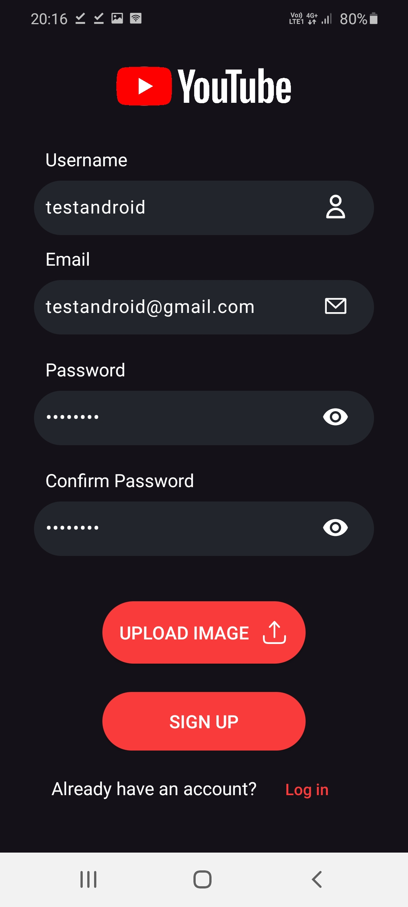

# Android sign-up and login.
This section shows how the Sign-up and Login works on the android-app.

# sign-up and login.

1. First we click the user icon on the bottom right.  

   

2. We then press the login button.  

   

3. We then press the sign up button at the bottom to move to the sign up screen.

   

4. We fill the details and make sure they are valid, and press the sign up button to complete the sign up process.

   

5. We are sent to the login scren, there we fill our details and press the login button.  

   

6. On a succesfull login we would be able to see our details on the profile screen.  

   

