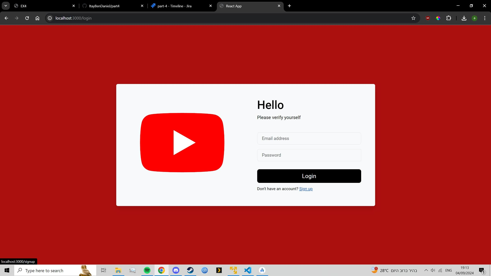
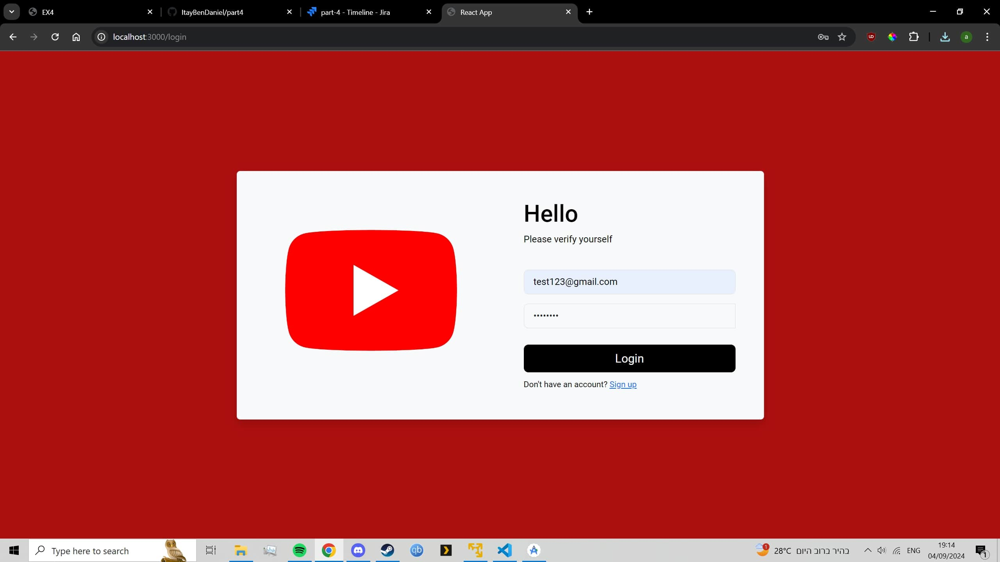

# React sign-up and login.
This section shows how the Sign-up and Login works on the react-app.

# sign-up and login.

1. First we click the sign in button on the top right.  

   

2. To sign up we press the sign-up button on the bottom of the login button.  

   

3. We fill the details and profile picture making sure they are valid and press sign up.

   

4. We fill the details of the user we just created and press login.

   

5. If we connected correctly we should see our profile picture on the top right, clicking on it gives us the option to log out , edit our details or delete our user.  

   

