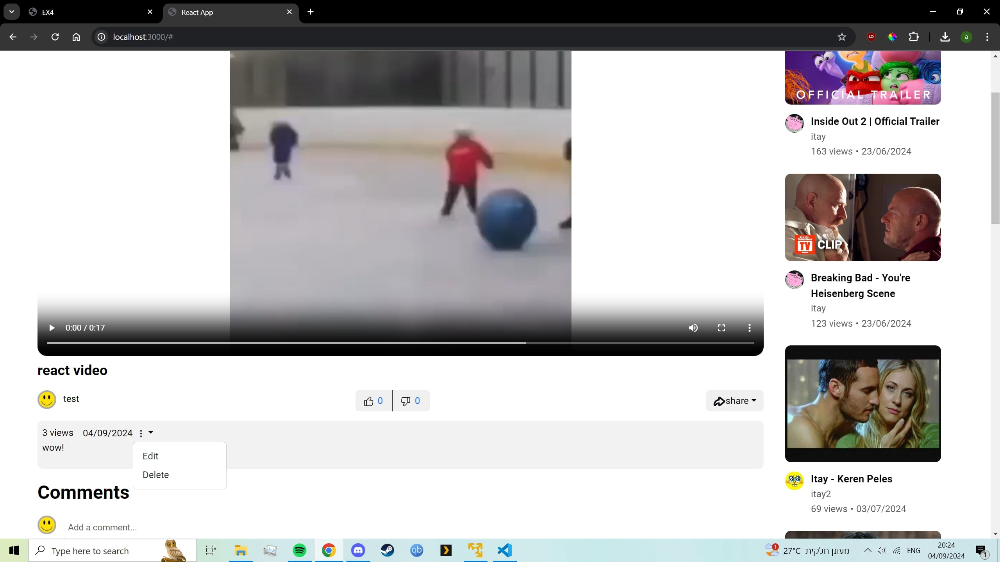

# Updating videos in the react and android apps.
This section shows how updating the videos on the apps works.

# Updating in the react app.

1. First we navigate to our video (making sure that we are connected to the user that uploaded the video), and press the 3 dots button , we choose edit.  

   

2. We fill in the details we want to change and save.  

   

3. We can see our details being changed in the react app.

   

4. We can see our details being changed in the android app.

   

# Updating in the react app.

1. First we navigate to our video (making sure that we are connected to the user that uploaded the video), and press the pencil button , we choose edit.  

   

2. We fill in the details and we can see our video changed in the android app.  

   

3. We can see the video changed when we interact with it in the android app.

   

4. We can see our updated video in the react app.

   

4. We can see the updated video file in the react app.

   