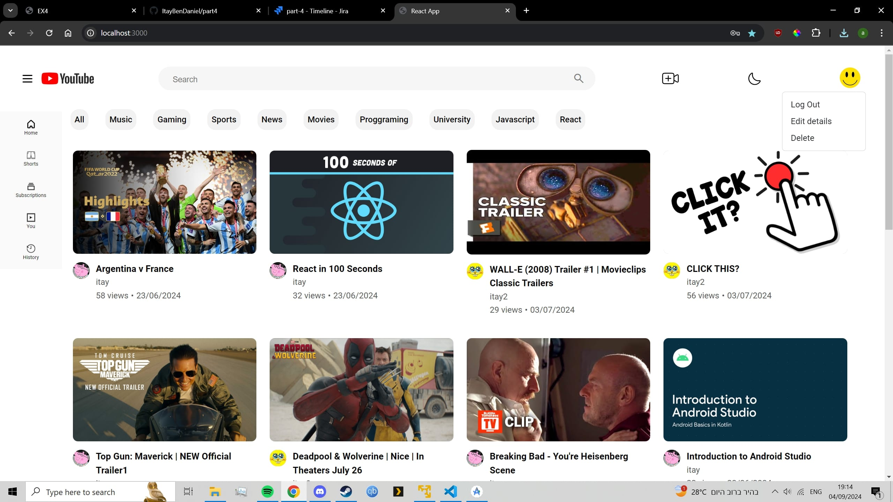

# React sign-up and login.
This section shows how to upload videos on both the react and android apps.

# Uploading a video in the react app.

1. First we make sure we are connected to a user (otherwise we would be navigated to the login screen), and press the upload button (to the right of the search bar) .  

   

2. We then select the video we want to upload by clicking choose file.  

   

3. We can see that the video was selected by its name appearing in the box and then we can press upload.

   

4. We the fill up our details and select the thumbnail and press next (the example pic here was taken later to showcase this).

   

5. We can then see our video appear in the main page.  

   

6. We can intercat with it and see our video.  

   

7. We can also interact with it in our android app.  

   

# Uploading a video in the android app.

1. We click the middle button of the menu (making sure we are connected to the app).  

   

2. We fill the details and press add video.  

   

3. We can see it appearing on the main page.  

   

4. We can interact with it in our android app.  

   

5. We can see the video appearing in our react app.  

   

6. We can also interact with the video in our react app.  

   

